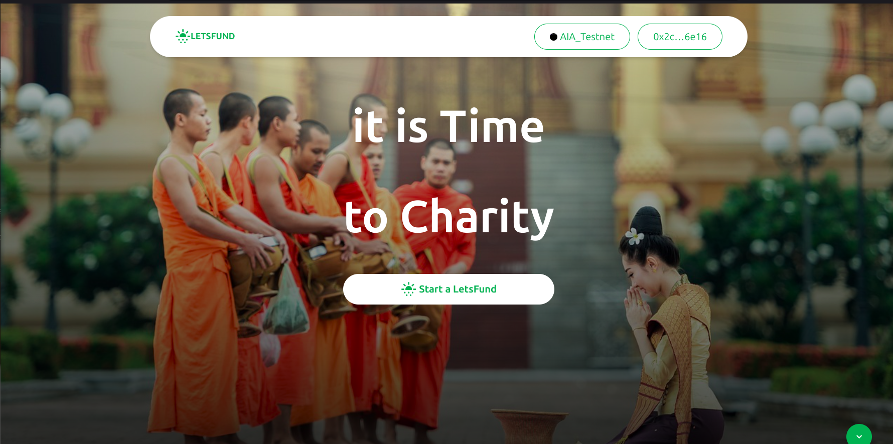

# LetsFund: Web3 Social / Consumer DApp on Linea

"letsfund" is a groundbreaking Web3 charity fundraising platform designed to revolutionize the way charitable organizations raise funds and engage with their communities. Deployed on the Linea Sepolia Blockchain, letsfund combines the transparency and security of blockchain technology with an intuitive user experience, allowing both donors and beneficiaries to experience a seamless and trustworthy process. By leveraging decentralized technologies, letsfund aims to minimize overhead costs, enhance donor engagement, and ensure that contributions have a direct and measurable impact.



Letsfund operates as a decentralized crowdfunding platform dedicated to charitable causes. Whether it's supporting humanitarian projects, funding healthcare initiatives, providing educational resources, or aiding disaster relief efforts, letsfund empowers organizations and individuals to raise funds effectively. The platform assures donors that their contributions are transparent and utilized appropriately, addressing the common concerns regarding the effectiveness of charitable donations.

The `LetsFund.sol` project is a Solidity smart contract that serves as the backbone of a decentralized application (dApp) for charity purposes. It leverages the OpenZeppelin library to ensure secure and standardized development of the contract.


The contract is designed around two primary structures: CharityStruct and SupportStruct, representing a charity and a supporter, respectively.

## Key features:

- createCharity: Allows a user to create a new charity.
- updateCharity: Allows the charity owner to update the details of an existing charity.
- deleteCharity: Allows the charity owner or contract owner to delete a charity.
- toggleBan: Allows the contract owner to ban or unban a charity.
- donate: Allows a user to donate to a charity.
- changeTax: Allows the contract owner to change the tax percentage.
- getCharity: Returns a single charity by its ID.
- getCharities: Returns all existing charities.
- getMyCharities: Returns all charities created by the caller.
- getSupports: Returns all supporters for a specific charity.

## Running the Application

Supply the following keys in your `.env` variable:

```sh
NEXT_PUBLIC_RPC_URL=http://127.0.0.1:8545
NEXT_PUBLIC_INFURA_API_KEY==<YOUR_INFURA_API_KEYD>
NEXT_PUBLIC_PROJECT_ID=<WALLET_CONNECT_PROJECT_ID>
NEXTAUTH_URL=http://localhost:3000
NEXTAUTH_SECRET=somereallysecretsecret
```

`YOUR_INFURA_API_KEY`: [Get Key Here](https://developer.metamask.io/)
`WALLET_CONNECT_PROJECT_ID`: [Get Key Here](https://cloud.walletconnect.com/sign-in)

Follow these steps to run the application:

1. Install the package modules by running the command: `yarn install`
2. Start the Hardhat server: `yarn blockchain`
3. Run the contract deployment script: `yarn deploy` or `yarn deploy --network linea_sepolia`
4. Run the contract seeding script: `yarn seed`
5. Spin up the Next.js development server: `yarn dev`

Now, your application should be up and running.

Linea_Sepolia contract address = 0x342b41E0F99fb95F1667BC634Ca0872709e6d4b2

https://sepolia.lineascan.build/address/0x342b41e0f99fb95f1667bc634ca0872709e6d4b2

## Important Project URLs

- Deployed Contract: https://sepolia.lineascan.build/address/0x342b41E0F99fb95F1667BC634Ca0872709e6d4b2
- Youtube video: https://youtu.be/DrqK19pH5q4
- Live dApp: https://letsfundcharity.vercel.app/
- Github Repo: https://github.com/holyaustin/letsfundcharity

## 📚 Key Technologies

- 🌐 Next.js: A React framework for building server-side rendered and static websites.
- 📘 TypeScript: A statically typed superset of JavaScript.
- 📦 Hardhat: A development environment for Ethereum smart contracts.
- 🌐 EthersJs: A library for interacting with Ethereum and Ethereum-like blockchains.
- 📚 Redux-Toolkit: A library for managing application state.
- 🎨 Tailwind CSS: A utility-first CSS framework.
- 🌈 @rainbow-me/rainbowkit-siwe-next-auth: A library for authentication in Ethereum dApps.
- 📝 React-Toastify: A library for adding toast notifications to your React application.
- 📜 Swiper: A modern mobile touch slider.
- 📚 Wagmi: A library for building Ethereum dApps.

## Useful links

- 🏠 [Linea Sepolia](https://sepolia.lineascan.build/)
- ⚽ [Metamask](https://metamask.io/)
- 💡 [Hardhat](https://hardhat.org/)
- 📈 [Alchemy](https://dashboard.alchemy.com/)
- 🔥 [NextJs](https://nextjs.org/)
- 🎅 [TypeScript](https://www.typescriptlang.org/)
- 🐻 [Solidity](https://soliditylang.org/)
- 👀 [EthersJs](https://docs.ethers.io/v5/)